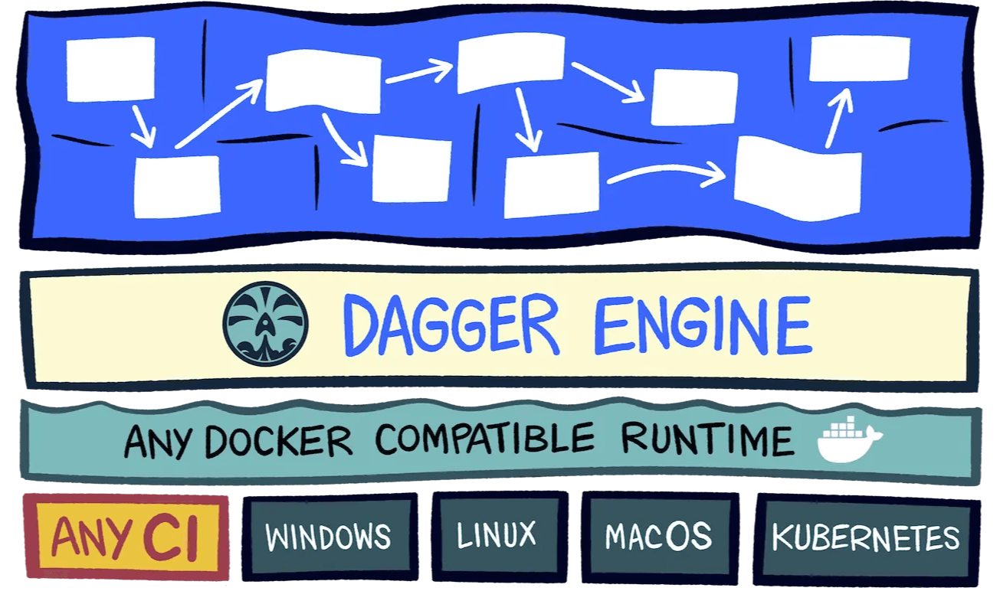
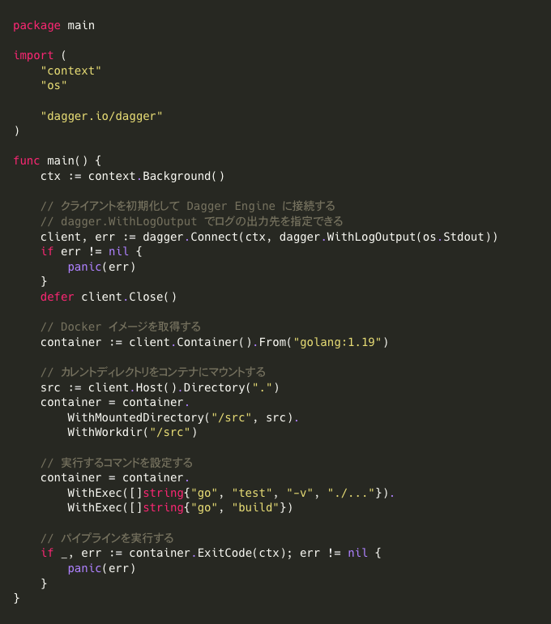

<!--
_class: heading
-->

<!--
* 「Dagger でポータブルな CI/CD パイプラインを作る」というテーマでお話させていただきます。
* よろしくお願いいたします。
-->

# Dagger でポータブルな<br/>CI/CD パイプラインを作る

3-shake SRE Tech Talk
<small>2022/12/15</small>


---

<!--
header: Dagger でポータブルな CI/CD パイプラインを作る
-->

<!--
* まず自己紹介です。
* 佐藤光輝と申します。
* 株式会社スリーシェイク Sreake 事業部で SRE エンジニアとして様々なお客様の技術支援をさせていただいております。
* ソロモン諸島検定 1 級を保持しています。
* GitHub・Twitter・Zenn のアカウントはこちらです。

(25s)
0:25
-->

# 自己紹介

<p style="font-size: 38px; font-weight: bold;">
佐藤 光輝 ( Sato Koki )
</p>

株式会社スリーシェイク
Sreake 事業部 SRE エンジニア
ソロモン諸島検定 1 級


<br/>

<a style="display: inline-flex; align-items: center; font-size: 32px; margin-bottom: 8px" href="https://github.com/koki-develop">

<span>@koki-develop</span>
</a>

<a style="display: inline-flex; align-items: center; font-size: 32px; margin-bottom: 8px" href="https://twitter.com/koki_develop">

<span>@koki_develop</span>
</a>

<a style="display: inline-flex; align-items: center; font-size: 32px" href="https://zenn.dev/kou_pg_0131">

<span>@kou_pg_0131</span>
</a>

---

<!--
* アジェンダです。
* まず最初に Dagger について簡単にご紹介いたします。
* 次に実際に Go SDK を使って簡単な CI/CD パイプラインを構築する例をご紹介いたします。
* その後 Dagger を使って嬉しいところについてお話した後、最後にまとめです。

(20s)
0:45
-->

# アジェンダ

1. Dagger について
1. Dagger Go SDK を使ってみる
1. Dagger の嬉しいところ
1. まとめ

---

<!--
_class: heading
-->

# 1. Dagger について

<!--

* まず Dagger についてです。
-->

---
<!--
header: Dagger でポータブルな CI/CD パイプラインを作る > 1. Dagger について
-->

<!--
* Dagger は Docker の創始者である Solomon Hykes 氏らが中心となって開発されています。
* Dagger とは、「コンテナ内で実行されるパイプラインを構築するプログラマブルな CI/CD エンジン」です。
* パイプラインはコンテナ内で実行されるため、実行環境に依存しないポータブルな CI/CD パイプラインを構築することができます。
* 例えばローカルマシンはもちろん、 GitHub Actions や CircleCI などといった CI ランナー、なんだったら Kubernetes 上でも動く CI/CD パイプラインを作ることが可能です。
* まさに「ポータブル」です。

(40s)
1:25
-->

# Dagger とは

- Docker の創始者である Solomon Hykes 氏らが中心となって開発
- コンテナ内で実行されるパイプラインを構築する**プログラマブル**な CI/CD エンジン
- 実行環境に依存しない**ポータブル**な CI/CD パイプラインを構築することができる
  - ローカルマシン、 GitHub Actions 、 CircleCI 、 Kubernetes ...

<div style="display: flex; flex-direction: column; align-items: center;">

<em style="font-size: 20px;">
<a href="https://dagger.io/">dagger.io</a> より引用
</em>
</div>


---

<!--
* Dagger ではいくつかの SDK が公開されています。
* 現時点では CUE SDK 、 Go SDK 、 Python SDK 、 Node.js SDK が公開されています。
* もともとは CUE SDK のみだったのですが、今年の 10 月から 11 月にかけて立て続けに Go・Python・Node.js SDK が公開されました。
* 今回は Go SDK の使い方をこの後ご紹介いたします。
* ちなみに記載していませんが GraphQL API や CLI も提供されています。

(30s)
1:55
-->

# SDK について

- 現在 Dagger には次の SDK が公開されている
  - [Dagger CUE SDK](https://docs.dagger.io/sdk/cue)
  - [**Dagger Go SDK**](https://docs.dagger.io/sdk/go) ( 今回紹介するのはこちら )
  - [Dagger Python SDK](https://docs.dagger.io/sdk/python)
  - [Dagger Node.js SDK](https://docs.dagger.io/sdk/nodejs)

---

<!--
header: Dagger でポータブルな CI/CD パイプラインを作る
_class: heading
-->

<!--
* それでは実際に Dagger Go SDK を使って簡単な CI/CD パイプラインを構築する例をご紹介いたします。
-->

# 2. Dagger Go SDK を使ってみる

---

<!--
header: Dagger でポータブルな CI/CD パイプラインを作る > 2. Dagger Go SDK を使ってみる
-->

<!--
* Dagger Go SDK のインストール手順ですが、 SDK 自体は普通の Go パッケージなので、 `go get` でインストールできます。

(15s)
2:10
-->

# Dagger Go SDK のインストール手順

## 1. モジュールを初期化

```sh
$ go mod init <モジュール名>
```

## 2. `go get` で Dagger Go SDK をインストール

```sh
$ go get dagger.io/dagger@latest
```

---

<!--
* サンプルコードはこちらに置いてあります。
* 実際に簡単なパイプラインを書きながら解説していきます。
( ここからライブコーディング )

(10s)
2:20
(2m30s)
4:50
-->

# サンプルコード

[koki-develop/dagger-go-sdk-example.git](https://github.com/koki-develop/dagger-go-sdk-example.git)



---

<!--
_class: heading
header: ""
-->

<!--
* Dagger を使っていて嬉しいところについてです。
-->

# 3. Dagger の嬉しいところ

---

<!--
header: Dagger でポータブルな CI/CD パイプラインを作る > 3. Dagger の嬉しいところ
-->

<!--
* もちろん他にもあるとは思いますが、「実行環境に依存しない」、「ローカルでも実行できる」、「普段使い慣れた言語で CI/CD パイプラインを構築できる」というのが特に Dagger を使っていて嬉しいところかなと思います。

(20s)
5:10
-->

# Dagger の嬉しいところ

<div style="font-weight: bold;">

1. 実行環境に依存しない
2. ローカルでも実行できる
3. 普段使い慣れた言語で CI/CD パイプラインを構築できる

</div>

---

<!--
* まず実行環境に依存しないというところです。
* Docker コンテナが動かせるところならどこでも実行できるので、パイプラインを構築するときに実行環境がローカルなのか、 GitHub Actions なのか、 CircleCI なのかなどを気にする必要が無いというのが嬉しいところかなと思います。
* 汎用的な module を用意しておいて、プロジェクトごとに使っている CI ランナーが異なっていても気にせずに使い回す、みたいな用途も考えられるかと思います。

(30s)
5:40
-->

# Dagger の嬉しいところ

## 1. 実行環境に依存しない

- パイプライン構築時に実行環境を気にしなくて済む
- 汎用的な module を用意しておいて、複数プロジェクトで使いまわすみたいなこともできそう
  - プロジェクトによって使用している CI ランナーが異なっていても大丈夫

---

# Dagger の嬉しいところ

<!--
* 実行環境に依存しないというのとかぶるところではあるんですが、やはりローカルでも実行できるというのが結構有り難いかなと思います。
* これは多分 CI/CD あるあるだと思うのですが、パイプラインの動作確認のためにコミット・プッシュして、コケて、直して、またコケて、みたいなことは経験ある方いらっしゃるんじゃないかなと思います。
* ローカルで CI/CD パイプラインを実行できることでそういった手間が無くなるので開発体験としてかなり良いのではないかなと思います。
* こういった悲しみのコミットログも生み出さなくて済みます。

(35s)
6:15
-->

## 2. ローカルでも実行できる

- デバッグするために毎回 commit・push しなくてもいい
- ↓こういう悲しみのコミットログを生み出さなくて済む

```
832ba5 CI パイプラインを構築
97211a 設定ミスを修正
a76d59 タイポ修正
604357 設定漏れがあったので修正
b63820 そろそろ動いてくれ
a6da69 頼む
8d0d47 これでもう大丈夫
a96caf 誰か助けて
```

---

# Dagger の嬉しいところ

<!--
* あとはもう普段使い慣れた言語で CI/CD パイプラインを構築できるというところですが、楽しいです。
* 僕は Go 言語が好きなのですが、好きな言語でゴリゴリ CI/CD パイプラインを構築できるのが新鮮で楽しかったです。
* あとはその言語の機能だったりエコシステムをフル活用できるので、より柔軟な CI/CD パイプラインの構築が可能となります。

(25s)
6:40
-->

## 3. 普段使い慣れた言語で CI/CD パイプラインを構築できる

- 楽しい
- 言語の機能やエコシステムをフル活用できる
  - より柔軟な CI/CD パイプラインの構築が可能になる

---

<!--
_class: heading
header: ""
-->

<!--
* まとめです。
-->

# 4. まとめ

---

<!--
header: Dagger でポータブルな CI/CD パイプラインを作る > 4. まとめ
-->

# まとめ

<!--
* めちゃくちゃ良いです。
* CUE 以外の SDK はまだ Technical Preview なんですが、触ってみた感じ CI/CD で最低限必要な機能は大体揃っているんじゃないかなと思います。
* Dagger のリポジトリとか覗いてみるとわかるんですが、開発もめちゃくちゃ活発なので今後が楽しみです。
* とにかく開発体験めちゃくちゃ良くて楽しいので、是非使ってみていただけましたらと思います。

(25s)
7:05
-->

- 良い
- とっても良い
- CUE 以外の SDK はまだ Technical Preview だけど必要な機能は十分揃っている感じ
- 開発めちゃくちゃ活発なので今後が楽しみ
- すごく良い

開発体験めちゃくちゃ良くて楽しいので是非使ってみてください。

---

<!--
* 最後におまけです。
* スライドはここに置いてあります。
* 発表に使用したツールに関してですが、このスライドは Marp という、マークダウンをスライドに変換するツールを使って作成しています。
* ライブコーディングに関しては cLive というツールを使用して自動化しました。
* この辺りのツールも結構面白いので機会があれば使ってみてください。

(20s)
7:25
-->

# スライドの置き場

- https://koki.me/3-shake-srett-2022-12-15/
- https://github.com/koki-develop/3-shake-srett-2022-12-15.git

# 発表に使用したツール

- Marp ( マークダウン → スライド変換 )
  - https://marp.app
- cLive ( ライブコーディング自動化 )
  - https://github.com/koki-develop/clive.git

---

<!--
* 発表は以上となります。
* ご清聴ありがとうございました。
-->

<!--
_header: Dagger でポータブルな CI/CD パイプラインを作る
_class: heading
-->

<div align="center">

# ご清聴ありがとうございました

</div>
